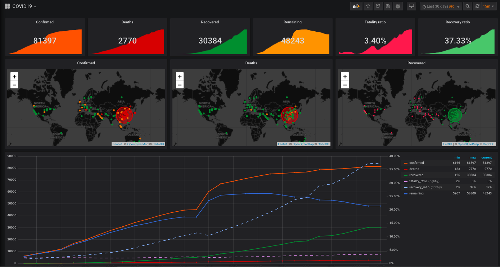
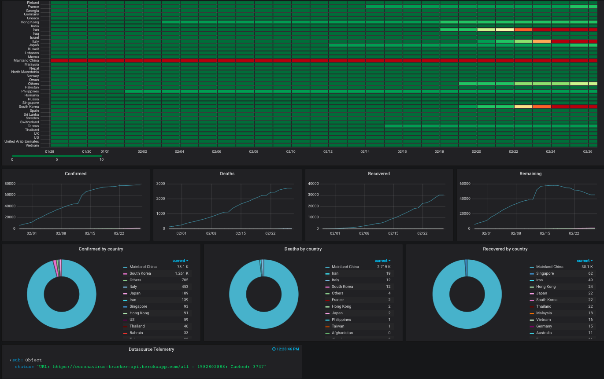

# Covid19 API parser and data visualizer
This is a quick (and dirty) project that was inspired by https://github.com/ExpDev07/coronavirus-tracker-api .
The idea was to get the data, store it in InfluxDB and visualize it with Grafana. 

This is not meant for production, it's a hobby project that I run locally on my laptop. Feel free to contribute to make it prod-ready.

As the Grafana dashboard is provisioned and the worldmap plugin is used with JSON datasources, the datapoint URLs are hardcoded in the provisioning files; they are set to http://localhost:5000 .
There are 2 endpoints:
- http://localhost:5000/locations : It returns the locations in JSON format, friendly to the Worldmap Grafana plugin.
- http://localhost:5000/refresh : It gets the data from ExpDev07 endpoint (https://coronavirus-tracker-api.herokuapp.com/all), transforms them into JSON format and stores them locally in influxdb. 

To avoid messing with cron in docker, the task of updating influxDB is delegted to http://localhost:5000/refresh . Then the Grafana Ajax plugin hits the endpoint and fills in influxdb. There is a "memory" mechanism in place that prevents frequent requests to ExpDev07's endpoint. Either way the endpoint uses heavy caching and updates seem to be daily.

# Run
docker-compose up

# UI
Below is the upper and lower part of the dashboard.

# Condolences and get well soon
My deepest condolences and prayers to the families of deceased people and a big warm "get well soon" to all confirmed ones!
